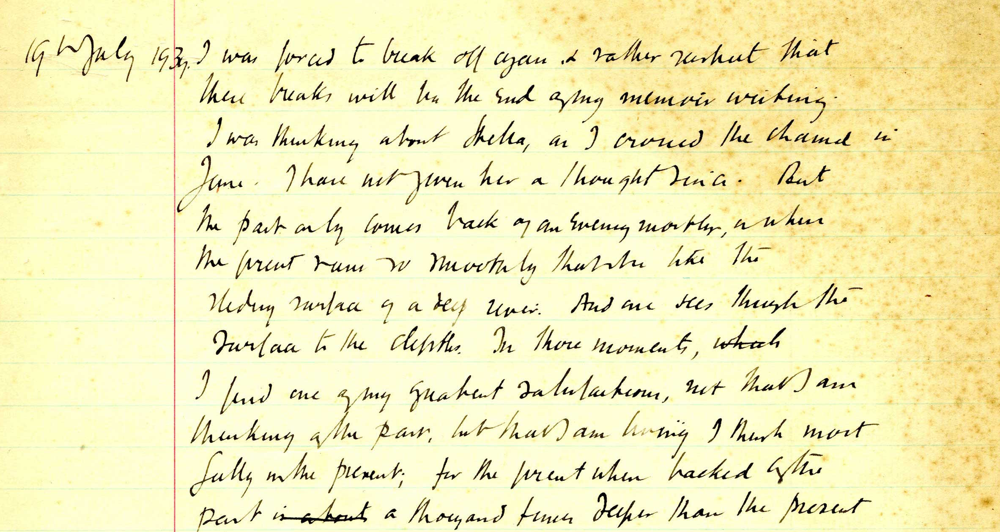
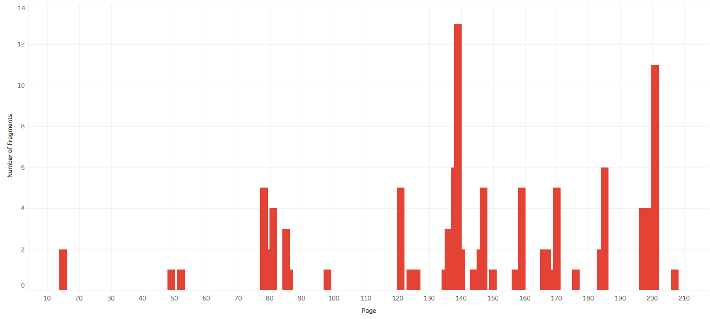

# The Fragments of Virginia Woolf’s *Between the Acts*

## Introduction

This project identifies, quantifies, and visualizes the fragments found in Virginia Woolf’s final novel, *Between the Acts*, published in 1941. In this context, fragments indicate the instances of text bounded by ellipses on either side—e.g. “. . . flying mounting through the air . . .” (15). Such instances articulate the wide array of voices throughout the novel. Yet they also seem too numerous and, therefore, too difficult to serve as the basis for an interpretation through close reading alone. Where do these fragments occur in the novel? Who speaks them? In which settings are they spoken? Answering these questions, by compiling and visualizing a dataset, might open new avenues of insight.

This approach both derives and departs from the work of Franco Moretti in *Graphs, Maps, and Trees*. In “Graphs,” Moretti writes,

> I began this chapter by saying that quantitative data are useful because they are independent of interpretation; then, that they are challenging because they often demand an interpretation that transcends the quantitative realm; now, most radically, we see them *falsify* existing theoretical explanations... (30)

Here, Moretti argues for a method that interweaves the quantitative and the qualitative so that they complement each other. Rather than begin with a qualitative assertion, he suggests that we might want to begin with data “independent of interpretation.” Such data, in turn, might encourage us to pursue new qualitative assertions that transcend the “qualitative realm.” This project hews closely to this model of literary scholarship: it proposes questions and compiles and visualizes data to construct, hopefully, an interpretation that moves beyond the data. At the same time, however, this project departs from Moretti with respect to scope. Rather than examine a large body of novels through quantitative methods, it examines one novel. Furthermore, it does not attempt to “falsify” existing theoretical explanations for the presence of these fragments in *Between the Acts* (though it could, possibly, falsify some critical interpretations of Woolf’s novel in a future iteration).   

## Data

To view the raw data file, please see [`between-the-acts-fragments.json`](https://github.com/tlewek/literary-grep/blob/master/between-the-acts/between-the-acts-fragments.json) in this repository.

### Process

To identify the fragments, I first downloaded a [plain text version](http://gutenberg.net.au/ebooks03/0301171.txt) of the novel. Then, using [TextWrangler](http://www.barebones.com/products/TextWrangler/), I ran a `grep` search to isolate the fragments; after doing so, I performed some additional cleanup. Next, I created a [`.json`](http://www.json.org/) file where each fragment became an object in a larger array. Within each object, I added four strings: `text`, `speaker`, `setting`, and `page`. To transform these strings into properties, I added values to each per the guidelines below:

1. `text`: the actual text of the fragment
2. `speaker`: the character, characters, or narrative voice that speaks the fragment
3. `setting`: the setting in which the fragment is spoken
4. `page`: the page number on which the fragment appears in the 1941 Harcourt edition

Adding values for strings 2–4 (`speaker`, `setting`, and `page`) required a human and, often, close reading of the novel. 

### Challenges

Compiling a dataset always involves human decisions, and this dataset emerges from many of them. For example, my `grep` search to isolate the fragments targeted any character, multiple times between ellipses (I used the regular expression `. . .(.*). . .`) returned data that required cleanup. In fact, this search often returned results such as

> . . . And Lord! The jangle and the din! The very cows joined in. Walloping, tail lashing, the reticence of nature was undone, and the barriers which should divide Man the Master from the Brute were dissolved. Then the dogs joined in. Excited by the uproar, scurrying and worrying, here they came! Look at them! And the hound, the Afghan hound . . . (184)

Should text like this example, which spans eight sentences, count as a fragment? I decided that it should not and, subsequently, refined my definition of a “fragment” to text at the sentence or sub-sentence level. Therefore, I did not include strings that spanned multiple sentences in my `.json` file. A string could end with a period, question mark, or exclamation before the closing ellipses, but such punctuation could not exist in the middle of that string.

Unsurprisingly, *Between the Acts* contains many ambiguities that complicate the compilation of `speaker` and `setting` values. For example, at times, it seems unclear who utters the fragment, or the fragment emerges from a collective. When confronted with these ambiguities, I relied on a small, controlled vocabulary—`villagers (chorus)`, `audience`, etc.—to generate values. At other times, Woolf assigns indistinct identities, such as “someone,” “audience,” “villagers,” or “two cronies,” to speakers. In these cases, I used these indistinct, but accurate, identities to generate values. To complicate data compilation further, many of Woolf’s characters are also actors within the play at the center of *Between the Acts*. In these instances, I have given actual names first, followed by the names of the characters they portray in parentheses. (Please note that Woolf identifies some of her characters only by the names of the characters they portray in the play.) Finally, the fragments attributed to Mrs. Lynn Jones remain more ambiguous than presented here. Woolf ostensibly places this character in conversation with Mrs. Etty Springett—fellow widows, Lynn and Etty attend the play together—but it seems that former merely talks at the latter. Woolf often highlights the setting of an uttered fragment by providing details in the text adjacent to the fragment itself (e.g. “between the trees,” “among the bushes”). More often, however, she does not, and I have had to rely on a small, controlled vocabulary (e.g.  “outdoor theater (stage)” or “outdoor theater (seats)”) to generate this data.

## Visualizations

To view the full, interactive visualizations, click on the screenshots below.

### Fragments over the Course of the Novel

### Fragments by Speaker

### Fragments by Setting

### Process

After completing the `.json` file, I converted it to an Excel spreadsheet and loaded the data into [Tableau Public](https://public.tableau.com/s/) where I produced the visualizations above. To represent the rise and fall in the quantity of fragments over the course of the novel, I chose a simple bar chart. Meanwhile, to represent the quantity of fragments by both speaker and setting, I chose treemaps.

### Challenges

By using bar charts and treemaps, I opted for legibility and limited dimensions and measures. While this seems necessary in any quantitative project, it also seems limiting in a humanistic one. In fact, the two-dimensionality of these visualizations efface many of the complexities of the data. How can a treemap represent the indistinct identities of various speakers or ambiguous settings such as “across lawns, down paths, past the house to the gravel strewn crescent” (197)?

In *Graphesis: Visual Forms of Knowledge Production*, Johanna Drucker argues for a humanistic approach to visualization in order to restore, or foreground, these complexities. As she writes,

> *Data are capta*, taken not given, constructed as an interpretation of the phenomenal world, not inherent in it.
	To expose the constructedness of data as capta a number of systematic changes have to be applied to the creation of graphical displays. That is the foundation and purpose of a *humanistic approach* to the qualitative display of graphical information. (128)
	
For Drucker, we do not simply find data in “the phenomenal world.” Instead, we construct data as we interpret this world. The humanities, however, ought to “expose the constructedness of data” through visual, in addition to textual, means. To do this, Drucker argues, humanists might create charts with unequal scale divisions or “skittish points on an unstable grid” (131, 134). Given the quantitative nature of this project, and the limitations of Tableau Public, however, I have not explored such humanistic options. Still, though these visualizations seem transparent, the underlying data contain complexities not fully represented here.

## Interpretations

With the dataset and visualizations complete, a few observations become clear. First, while these fragments occur throughout *Between the Acts*, they do not seem evenly distributed. As the bar chart reveals, approximately 41% (44) of the 115 fragments occur in two, small page ranges: 135–140 (25) and 197–201 (22). The former page range occurs when the character of Millie Loder comes on stage as Flavinda (she remains the only character identified by both actual and stage names in the novel). The latter occurs as the audience disperses after the play’s conclusion. Woolf, it seems, employs large quantities of concentrated fragments to stylistically punctuate important moments—the recognition of actual and stage identities, the aftermath of the performance—in the reception of the play. Second, ... Third, ...

## Works Cited

Drucker, Johanna. *Graphesis: Visual Forms of Knowledge Production*. Harvard UP, 2014.

Moretti, Franco. *Graphs, Maps, Trees: Abstract Models for Literary History*. Verso, 2007.

Woolf, Virginia. *Between the Acts*. Harcourt, 1941.